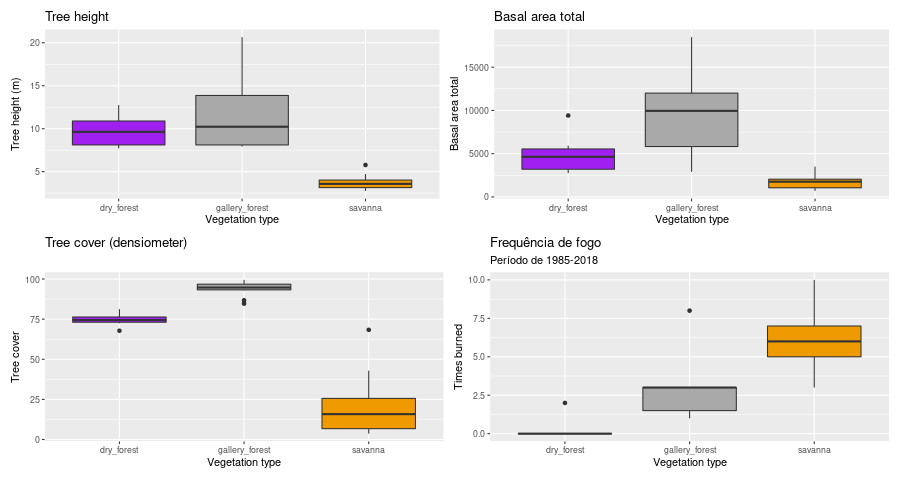

## O objetivo deste repositório e fazer análises e figuras para a minha tese.

Neste repositório eu manipulo os dados que utlizei no capítulo II da minha tese de doutorad. 

O objetivo é testar se mata seca, mata de galerie e savannas são estados alternativos funcionais e estruturais em uma paisagem heterogênea no Cerrado Brasileiro.

Para isso, usamos dados remotos e dados coletados em campo. Os dados remotos são a cobertura do dossel de Hansen et al, os dados de precipitação do CHIRPS dataset, os dados de satélite do Landsat 8 e os dados do Mapbiomas de frequência de fogo e de cobertura do solo. Além disso, ainda utilizamos dados coletados em campo como a cobertura do dossel medida <i>in situ</i> com o densiômetro florestal côncavo, altura das árvores, área basal total de cada parcela da vegetação amostrada, espessura de casca de cada árvore e dados das amotras de solo onde avaliamos os macro e micro nutrientes, assim como granulometria.
O regime de fogo é apontado pela literatura como determinantes da estrutura da vegetação, assim como a fertilidade do solo. Dessa forma, usamos os dados do Mapbiomas de frequência de fogo para ver se o regime de fogo é ou não um determinante da funcionalidade e da estrutura. Da mesma forma usamos os dados de solo coletados em campo e os dados de profundidade de raízes, e profundidade do lençol freático estimados em modelos por Fan et al (2017) - PNAS. Estes dados da Fan et al possuem uma resolução de 1 Km e são bem grosseiros.
 
As **variáveis de estado funcional**, ou seja, aquelas que dão identidade funcional ao sistema, são o acoplamento [i.e.correlação de Kendall entre as médias mensais do índice de vegetação (EVI2 - 2 banded enhanced vegetation index) e da precipitação nos pontos de coleta] o atraso em meses na resposta mais acoplada da vegetação (i.e. maior valor de correlação) e a deciduidade, que é a diferença entre a cobertura do dossel nas estações chuvosa e seca. Os **indicadores de funcionalidade** são os parâmetros (e.g. média, desvio padrão, máximo e amplitude) da série temporal do EVI2 (i.e. indica a fenologia das folhas de cada parcela dentro dos diferentes tipos de vegetação) e os atributos funcionais como a espessura de casca (bark thickness). Os **variáveis de estado estruturais** são a cobertura do dossel (tree cover) tanto a estimada remotamente (i.e. a do Hansen) como a que medimos em campo com o densiômetro florestal côncavo. As **variáveis ambientais** para estimar a heterogeneidade da paisagem provém das amostras de solo e dos modelos da Fan et al (2017).

Juntando todos os dados, temos um resumo:

```{r, echo = F,include=F}
library(tidyverse)
library(patchwork)
library(RColorBrewer)
```

```{r echo=FALSE, include=FALSE}
fire <- read.table("./fire_freq_pontos.txt")

tc_field <- read.table("./tc_field.txt", h = T)
#write.table(tc_field, "tc_field.txt")

tc_hansen <- read.table("./tc_hansen.txt", h = T) 
#write.table(tc_hansen, "tc_hansen.txt")


coup <- read.table("./coup.txt", h = T) 
#write.table(coup, "coup.txt")

traits <- read.table("./traits_community_mean.txt", h = T)
#write.table(traits, "traits.txt")


evi2 <- read.table("evi2_estatistic.txt", h = T)

deciduousness <- (tc_field$wet-tc_field$dry)
data <- coup %>% add_column(freq_fire = fire[1:30,1]) %>% add_column(tree_cover_wet = tc_field$wet)%>% add_column(tree_cover_dry = tc_field$dry) %>% add_column(tree_cover_hansen = tc_hansen[1:30,1]) %>% add_column(phenology = deciduousness) %>% add_column(evi2[1:30,1:4]) %>% rename(Vegetation_type=Fitofisionomia)

```

```{r echo=FALSE, include=TRUE, warning=FALSE}
data %>% summary %>% knitr::kable()
```


As diferenças podem ser melhor identificadas visualmente através de boxplots como abaixo. Primeiro, mostro as **variáveis de estado funcionais** por tipo de vegetação.

```{r echo=TRUE, include=FALSE, warning=FALSE}
a<- data %>% 
  ggplot()+
   aes(y = Coup_lag_max, fill = factor(Vegetation_type), x = factor(Vegetation_type))+
  geom_boxplot(show.legend = FALSE)+
  ggtitle("Maximum coupling")+
   scale_fill_manual(values=c("purple", "darkgrey", "orange2"))+  ylab("Coupling")+
  xlab("Vegetation type")


b<-data %>% 
  ggplot()+
  aes(y = Lag, fill = factor(Vegetation_type), x = factor(Vegetation_type))+
  geom_boxplot(show.legend = FALSE)+
  ggtitle("Lag in months for the max coupling")+
   scale_fill_manual(values=c("purple", "darkgrey", "orange2"))+
  ylab("Lag in months")+
  xlab("Vegetation type")


c<-data %>% 
  ggplot()+
  aes(y = deciduousness, fill = factor(Vegetation_type), x = factor(Vegetation_type))+
  geom_boxplot(show.legend = FALSE)+
  ggtitle("Deciduousness", subtitle = "Differentece btw dry and wet seasons")+
     scale_fill_manual(values=c("purple", "darkgrey", "orange2"))+
  ylab("Deciduousness")+
  xlab("Vegetation type")

```

<p align="center">

</p>

**Indicadores remotos de funcionalidade** são amplamente utilizados na literatura, como os índices de vegetação. Entretanto, estes índices não são necessariamente bons indicadores quando o objetivo é diferenciar os tipos de vegetação, pois eles não capturam o comportamento da série ao longo do tempo.

```{r echo=TRUE, include=FALSE, warning=FALSE}
a3<-data %>% 
  ggplot()+
  aes(y = mean, fill = factor(Vegetation_type), x = factor(Vegetation_type))+
  geom_boxplot(show.legend = FALSE)+
  ggtitle("Mean EVI2")+
   scale_fill_manual(values=c("purple", "darkgrey", "orange2"))+
  ylab("Mean EVI2")+
  xlab("Vegetation type")

b3<-data %>% 
  ggplot()+
  aes(y = sd, fill = factor(Vegetation_type), x = factor(Vegetation_type))+
  geom_boxplot(show.legend = FALSE)+
  ggtitle("Standard deviation EVI2")+
   scale_fill_manual(values=c("purple", "darkgrey", "orange2"))+
  ylab("Standard deviation EVI2")+
  xlab("Vegetation type")

c3<-data %>% 
  ggplot()+
  aes(y = max, fill = factor(Vegetation_type), x = factor(Vegetation_type))+
  geom_boxplot(show.legend = FALSE)+
  ggtitle("Maximum EVI2")+
   scale_fill_manual(values=c("purple", "darkgrey", "orange2"))+
  ylab("Maximum EVI2")+
  xlab("Vegetation type")

d3<-data %>% 
  ggplot()+
  aes(y = range, fill = factor(Vegetation_type), x = factor(Vegetation_type))+
  geom_boxplot(show.legend = FALSE)+
  ggtitle("Amplitude EVI2")+
   scale_fill_manual(values=c("purple", "darkgrey", "orange2"))+
  ylab("Amplitude EVI2")+
  xlab("Vegetation type")

```

<p align="center">

</p>

Note que a média e o desvio padrão do EVI2 não são bons indicadores de diferenças funcionais entre os diferentes tipos de floresta (i.e. mata seca e mata de galeria), que sabemos possuem respostas às oscilações na chuva (acoplamento e lag) e fenologias totalmente distintas.

Da mesma forma, na escala espacial da paisagem, a cobertura do dossel dos dois tipos de floresta diferem pelo densiômetro florestal, mas não diferem entre si quando analisamos os dados remotos de cobertura do dossel. Em escala continental, florestas são consideradas vegetações com cobertura do dossel acima de 60% e abaixo disso considera-se savanas. Dessa forma, é muito fácil que os diferentes tipos de florestas sejam tratadas da mesma forma ou até mesmo sejam computadas como savanas, o que aumenta o erro das análises e dos modelos.

```{r tree_cover_make, echo=TRUE, include=FALSE, warning=FALSE}
a4 <- data %>%  ggplot()+
  aes(x= tree_cover_wet, fill = factor(Vegetation_type))+
  geom_histogram(show.legend = FALSE)+
  ggtitle("Tree cover (densiometer)")+
   scale_fill_manual(values=c("purple", "darkgrey", "orange2"))+
  ylab("Tree cover (%)")+
  xlab("Vegetation type")

b4 <- data %>% ggplot()+
  aes(x = tree_cover_hansen, fill = factor(Vegetation_type))+
  geom_histogram(show.legend = FALSE)+
  ggtitle("Tree cover (Remote estimation)")+
   scale_fill_manual(values=c("purple", "darkgrey", "orange2"))+
  ylab("Tree cover (%)")+
  xlab("Vegetation type")
```

<p align="center">

</p>

***

Mesmo assim, alguns trabalhos argumentam que a funcionalidade é correspondente à estrutura da vegetação. Eles se baseiam na área basal e na altura de árvores como variáveis funcionais e que também podem indicar estrutura (Xu et al, 2016; Dantas et al 2021?). Mesmo assim, sabe-se que a altura da árvore influencia no seu funcionamento, uma vez que o fluxo de água no interior da planta depende da diferença de pressão entre o solo e a superfície foliar e que esta pressão depende do comprimento dos vasos.

Nas figuras abaixo, mostro que as **variáveis de estado estruturais** inferidas por área basal e altura de árvores são em parte bons preditores de diferenteças funcionais da vegetação.

<p align="center">

</p>